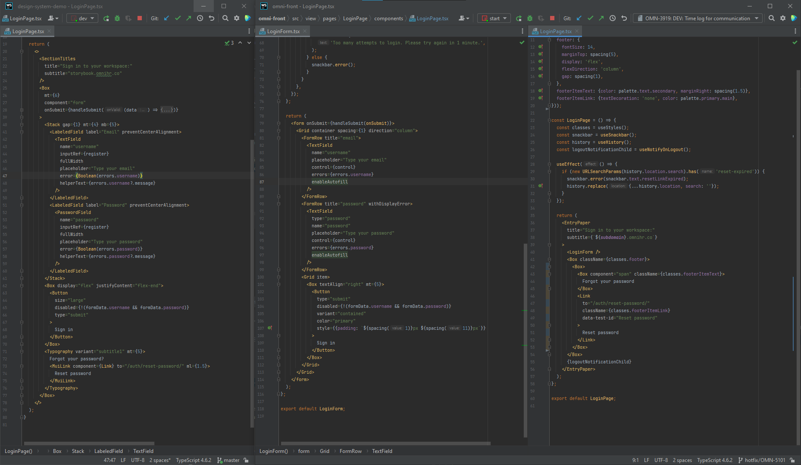

# OMNI design system demo

This project is a short example built on top of the existing OMNI HR project. It shows a way how we could build a design system and integrate it into our app. For more details on the design system, visit [this page](./design-system/README.md).

## Setup

**If you're a dev who wants to launch it locally**, you'll need to clone the repo and install all the dependencies. Notice that the project has two packages (read: `package.json` files). This means that you may launch Storybook separately from the final application. 

The project is built with vite, so you may run `yarn dev --open` in the root directory. It'll launch a Vite dev server and open the site as soon as it's ready. You can drop the `--open` parameter if you don't want the site to be opened.

> The first launch may take some time, but after that it'll be in a flash

Voilà! The dev server is running, and you may explore what's been built.

## Explore functionality and UI/UX

**If you want to explore the deployed version**, use [this link](https://master--lovely-sorbet-f35af7.netlify.app/) (or the locally launched app). You'll land on the login page. You should be able to do all the basic interactions. You can see some minor differences from our current design (i.e. the colors of a disabled button), but I tried not to dig too deep into the customization.

As for the result of submission, you should see the data from the form logged into the console.

### _Login_ page

To imitate a user entering wrong email-pass pair, you should use the `wrongpass` password, it'll show you the error UI.

Also, you can visit the _Reset password_ page to request an email to reset the password.

### _Set password_ page

To display the _Email_ row available in case the user sets the initial password from the onboarding email, you may add the `email` query parameter that will be displayed (try [here](https://master--lovely-sorbet-f35af7.netlify.app/auth/set-password/?email=test@omnidemo.com)).

If you don't provide the `email` parameter, the page will look as if you try to reset your password.

To imitate the _Link is expired_ flow, use the magic `expire-link` value for the `email` parameter (try [here](https://master--lovely-sorbet-f35af7.netlify.app/auth/set-password/?email=expire-link)). When you'll try to submit the form, it'll show the error message that you link was expired.

---

But all of this is done only to show you that it looks and behaves mostly like the actual app. The new ideas are coming next.

## Exploring the code

The most interesting part of this repo is not _what_ we build, but _how_ we build. You may check out the sources of the components, and they have so much less code and configs, because we use all the standard things, and they're configured not in the components, but in a separate place (we'll get back to it later).

Login page

On the left hand side, we use the native TextField with no need to create a custom component that supports all the text field variations we need (and breaks all the time). A couple of inline spacing styles are applied, but they are agreed to be unified in the design system, so that we can just copy-paste small pieces of markup from there. And we need none of these `classes`, because the appearance is actually something built-in into our theme rather than something custom and local to the page (such cases are valid, but not here, we have three pages that are very similar). 

The same differences can be followed on all three pages. The main idea here is

> Don't invent the wheel if some element or design has already been built

On the other hand, we can try to make the copy-paste as reasonable as possible, and generalize things where it makes sense (i.e. titles may become a part of the `PublicRouteContainer`, if we're sure that ideologically they fit there).

## Check out the design system

The main part of the proposal is not the application, but the design system that it's built with. For more details, see [the next doc](./design-system/README.md).
